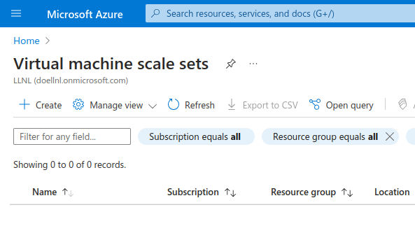
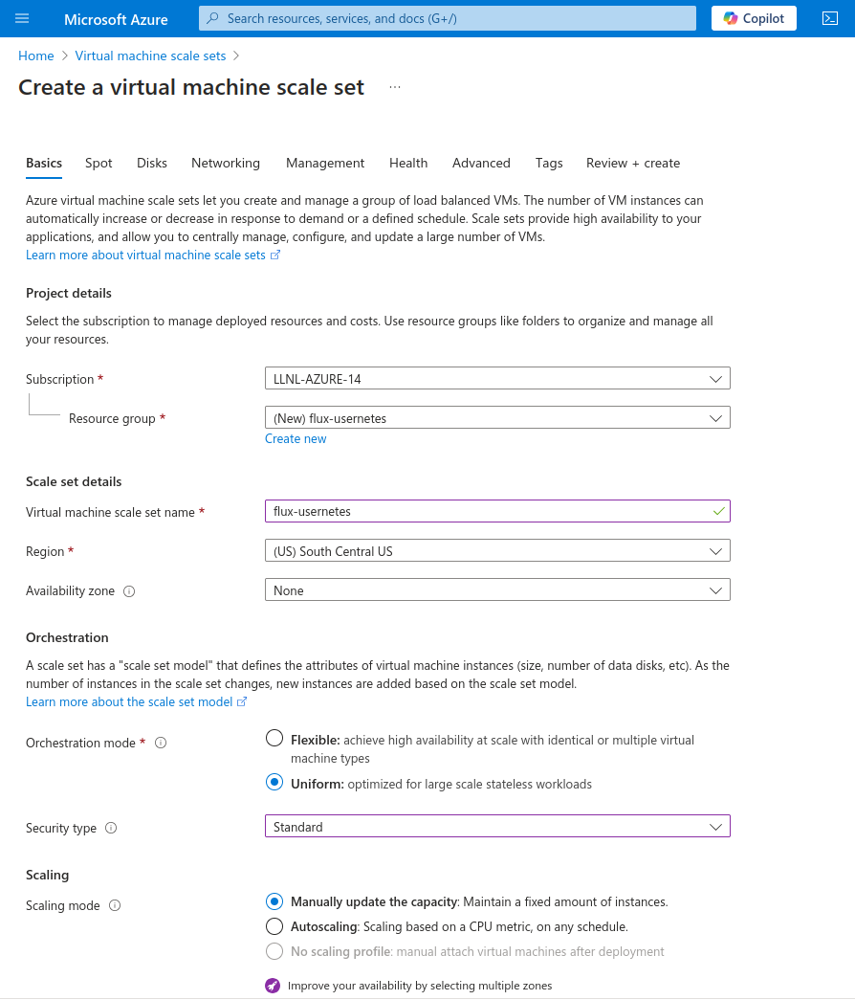
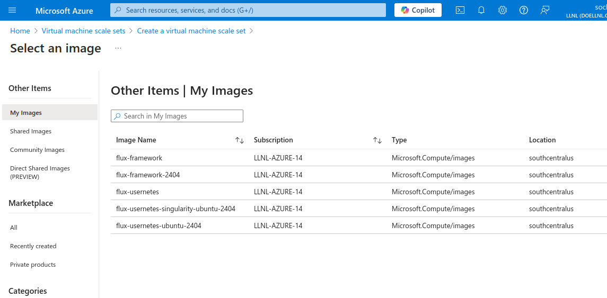
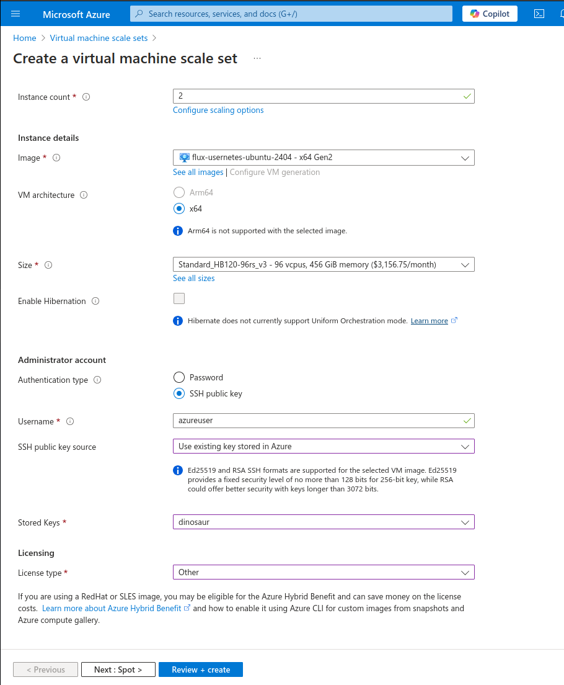
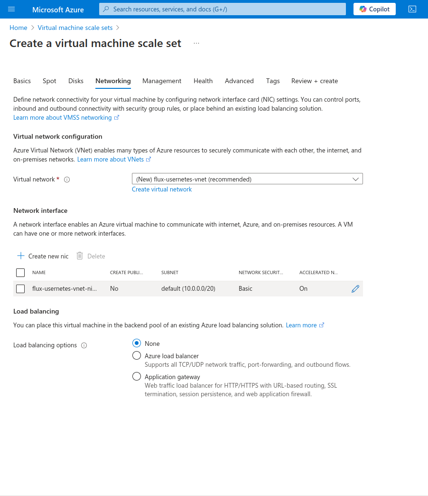
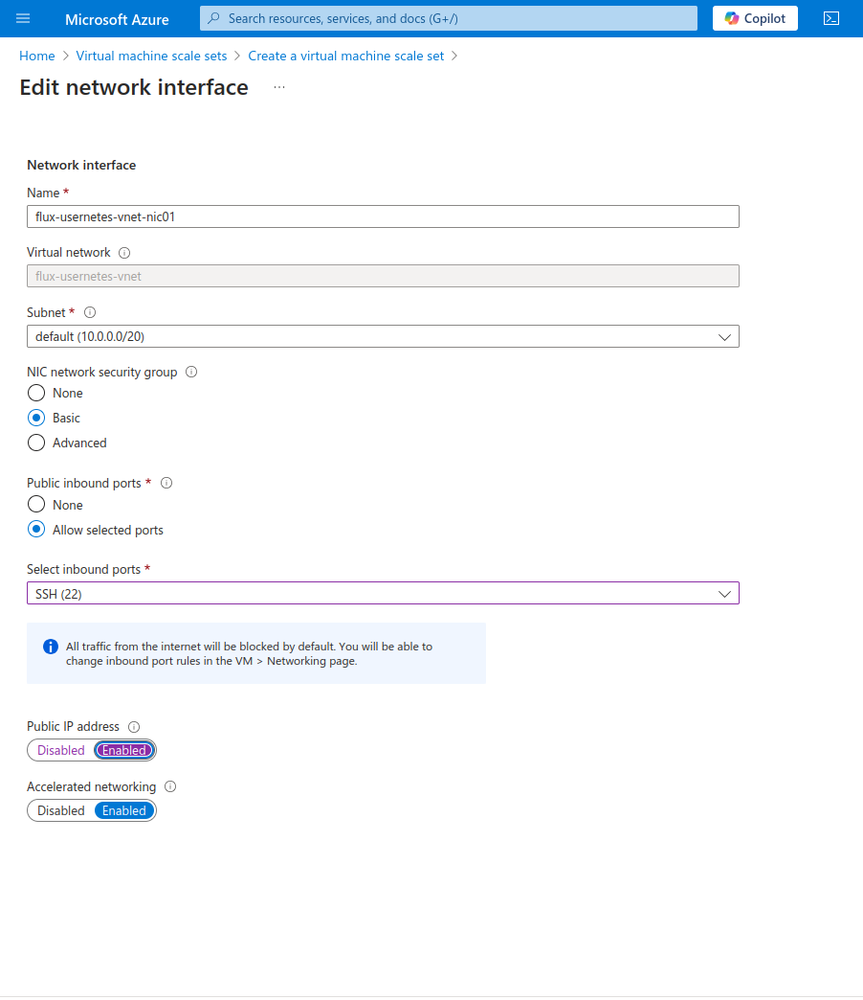
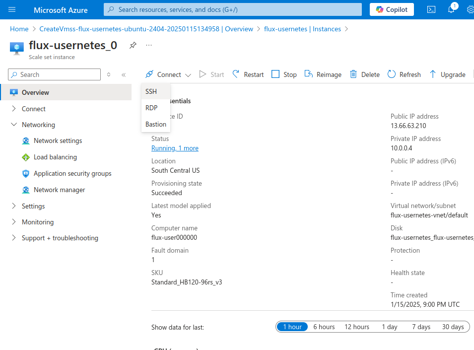

# Flux Usernetes on Azure

## Usage

### 1. Build Images

Note that you should build the images first. There are two variations here:

 - [build-ubuntu-24.04](build-ubuntu-24.04): includes a simple, reproducible build for ubuntu 24.04 (developed by us)
 - [build](build) uses the azure-hpc base image, which is dated to 2022 with ubuntu 22.04 and has a lot of software bloat.

Follow the instructions in the READMEs there. Note that containers (for the ubuntu 24.04 environment) are provided from the [flux-tutorials](https://github.com/converged-computing/flux-tutorials) repository.

### 2. Deploy on Azure

The deployment is done through the web interface. After you have created the image, you can navigate to the [Virtual Machine Scale Set](https://portal.azure.com/#browse/Microsoft.Compute%2FvirtualMachineScaleSets) page in the interface. Click on "+ Create" in the top left.



#### Configuration

Choose a name for a new resource group, and the VM set. I usually choose `flux-usernetes` and then the computer prefix will be `flux-user`. I usually choose the following:



Under image, select "See all images" and then "My images" on the left. You should see the image that you built (in the image below, we are selecting "flux-usernetes-ubuntu-2404."



If you click it, it will return to the basics screen with the image selected. For the remainder of the page, it's recommended to use an HPC instance (e.g., HB120). I typically 
also use an existing key in Azure, and the other options shown below.



The next tabs can be useful for tweaking volume sizes (I usually leave as is). Next, you will want to click on the pencil "edit" sign next to the "Create New Nic" entry in the table.



This will take you to where you can customize the NIC. You need to expose port 22 (for your ssh) and also set the public IP address to enabled.



Finally, in the advanced tab you will want to check "Enable user data" and copy the contents of [startup-script.sh](startup-script.sh) into the box that appears. This will ensure that the cluster comes up. If you change the name of the VM Scale Set from flux-usernetes to something else, you will want to capture the first 9 letters in the prefix at the top for `template_name`. The other variables will stay the same, unless you have reason to know the network device will be different. Finally, click "Validate and Create."

### 3. Install Applications

We can use parallel ssh to build specific applications across nodes. The scripts in [install](install) provide a few examples. I usually do this from the cloud shell where I have az, but you don't need to. First, install pssh:

```bash
git clone https://github.com/lilydjwg/pssh /tmp/pssh
export PATH=/tmp/pssh/bin:$PATH
```

If you need to, clone the repository here.

```bash
git clone https://github.com/converged-computing/flux-usernetes
cd flux-usernetes/azure
```

You will likely need to upload your pem key and change permissions:

```bash
chmod 600 id_azure.pem
```

Let's say it's called `id_azure.pem`. Next, generate a list of hosts. Note that we have the name of both the resource group and the vm scale set (they happen to be the same thing here):

```bash
for address in $(az vmss list-instance-public-ips -g flux-usernetes -n flux-usernetes | jq -r .[].ipAddress)
  do
    echo "azureuser@$address" >> hosts.txt
done
```

Now we can install scripts, for example OSU and LAMMPS.

```bash
for script in $(echo osu lammps)
  do
  for address in $(cat ./hosts.txt)
   do
     scp -i ./id_azure.pem ./install/install_${script}.sh ${address}:/tmp/install_${script}.sh
  done
  pssh -h hosts.txt -x "-i ./id_azure.pem" "/bin/bash /tmp/install_${script}.sh"
done
```

### 4. Install Usernetes

You could run these commands in the different instances, but it is easier to do programatically.

#### Bring up the control plane

For the first argument, this is the ranks list to go to flux archive -> flux exec. For example, if broker 2 is up you'd provide "2." If a range between 2 and 10 is up, you'd provide "2-10"

```console
ip_address=$(az vmss list-instance-public-ips -g flux-usernetes -n flux-usernetes | jq -r .[0].ipAddress)
scp -i ./id_azure.pem ./install/start_control_plane.sh azureuser@${ip_address}:/tmp/start_control_plane.sh
ssh -i ./id_azure.pem azureuser@${ip_address} "/bin/bash /tmp/start_control_plane.sh 1"
```

#### Bring up workers

```console
# This goes through all addresses except for the first
sed '1d' hosts.txt > workers.txt
for address in $(cat workers.txt)
  do
     scp -i ./id_azure.pem ./install/start_worker.sh ${address}:/tmp/start_worker.sh
done
pssh -t 10000000 -h workers.txt -x "-i ./id_azure.pem" "/bin/bash /tmp/start_worker.sh"
```

#### Finish control plane

This last command runs the sync-external-ip command. The `ip_address` variable should still be defined to have the lead broker address.

```console
scp -i ./id_azure.pem ./install/finish_control_plane.sh azureuser@${ip_address}:/tmp/finish_control_plane.sh
ssh -i ./id_azure.pem azureuser@${ip_address} "/bin/bash /tmp/finish_control_plane.sh"
```

### 5. Shell In

You can get the address of the lead broker from the `ip_address` variable above. You can also get it from the web interface - there will be a button to connect via SSH you can click to see the public IP address.



On the command line, it might look like this:

```bash
ssh -o IdentitiesOnly=yes -i ~/.ssh/id_azure.pem azureuser@13.66.63.210
```

If everything worked OK, you should see that your flux instance is running (in our case, just one lead and one follower broker, a cluster size of 2 nodes):

```console
$ flux resource list
     STATE NNODES NCORES NGPUS NODELIST
      free      2    192     0 flux-user[000000-000001]
 allocated      0      0     0 
      down    998  95808     0 flux-user[000002-000999]
```

Note that a huge number of brokers will be listed as offline. We do this because Flux can see nodes that don't exist as offline, and if we increase the size of the cluster they can join easily. 
And rootless docker should work:

```bash
docker run hello-world
```

#### Check Infiniband

How to sanity check Infiniband:

```bash
ip link

ibv_devinfo
ibv_devices 
# (should show two)
/etc/init.d/openibd status
```

If you need to check memory that is seen by flux:

```bash
flux run sh -c 'ulimit -l' --rlimit=memlock
unlimited
```

#### Environment

Here is a reasonable environment to try. You can tweak this to your liking. You can also add it to the [startup_script.sh](startup_script.sh) (echo into the azureuser `.bashrc`) to have them persist.

```bash
export OMPI_MCA_btl_openib_warn_no_device_params_found=0
export OMPI_MCA_btl_vader_single_copy_mechanism=none
export OMPI_MCA_btl_openib_allow_ib=1
# Choose one - I found lammps does better with "all"
export UCX_TLS=all
export UCX_TLS=ib,shm
export UCX_NET_DEVICES=mlx5_0:1
```

### 6. Run "Bare Metal" vs Container Applications

#### OSU Benchmarks

Singularity is installed in the VM. Let's use flux exec to issue a command to the other broker and pull singularity containers. These two containers have the same stuff as the host! This is why you typically want to create nodes with a large disk - these containers are chonky.

```bash
# Note that you may need to change the rank identifier depending on what you got!
flux exec --rank 0-1 singularity pull docker://ghcr.io/converged-computing/flux-tutorials:azure-2404-osu
```

Let's run each with Flux. Note that you likely need to adjust the `UCX_TLS` parameter.

```bash
# Container runs
flux run -N2 -n 192 -o cpu-affinity=per-task singularity exec --bind /opt/run/flux ./flux-tutorials_azure-2404-osu.sif /opt/osu-benchmark/build.openmpi/mpi/collective/osu_allreduce
flux run -N2 -n 2 -o cpu-affinity=per-task singularity exec --bind /opt/run/flux ./flux-tutorials_azure-2404-osu.sif /opt/osu-benchmark/build.openmpi/mpi/pt2pt/osu_latency
```
```bash
# Bare metal
flux run -N2 -n 192 -o cpu-affinity=per-task /tmp/osu-micro-benchmarks-5.8/mpi/collective/osu_allreduce
flux run -N2 -n 2 -o cpu-affinity=per-task /tmp/osu-micro-benchmarks-5.8/mpi/pt2pt/osu_latency
```

#### LAMMPS-REAX

Now pull lammps:

```bash
cd /tmp/lammps/examples/reaxff/HNS
flux exec --rank 0-1 singularity pull docker://ghcr.io/converged-computing/flux-tutorials:azure-2404-lammps-reax
```

And run, with the same binds, again using the container and bare metal.

```bash
# I've seen this range from 1:07 to almost 2 minutes.
flux run -o cpu-affinity=per-task -N2 -n 192 singularity exec --bind /opt/run/flux ./flux-tutorials_azure-2404-lammps-reax.sif /usr/bin/lmp -v x 16 -v y 16 -v z 16 -in in.reaxff.hns -nocite

# Bare metal
flux run -o cpu-affinity=per-task -N2 -n 192 /usr/bin/lmp -v x 16 -v y 16 -v z 16 -in in.reaxff.hns -nocite
```

### 7. Install the Flux Operator

Finally, let's install the Flux Operator and run an application there. You should have `KUBECONFIG` already exported on the path.

```bash
# enable auto-completion
source <(kubectl completion bash)

kubectl apply -f https://raw.githubusercontent.com/flux-framework/flux-operator/refs/heads/main/examples/dist/flux-operator.yaml

# Check that it's running OK
kubectl logs -n operator-system operator-controller-manager-69cdcdb9ff-cmrmd 
```

### 8. Run Applications

You'll also have a few YAML files in the [examples](examples) directory. After you install the operator, try adding one to the VM and creating an interactive MiniCluster:

```bash
kubectl apply -f ./osu.yaml
kubectl get pods --watch
kubectl exec -it flux-sample-0-xxx -- bash
```

This will create an interactive cluster to shell into - you can ignore the bash errors (there is a path in the source that will work for the Singularity container when a slightly different path is bound from the host). First, connect to the flux broker, and once you are connected to the instance, test with `flux resource list`.

```bash
flux proxy local:///mnt/flux/view/run/flux/local bash
export FLUX_URI=local:///mnt/flux/view/run/flux/local
```

This is helpful for debugging, if needed.

```bash
apt-get install -y ibverbs-utils
```

### 9. Cleanup

When you are done, you can delete the entire resource group in Azure.

```bash
az group delete --name flux-usernetes
```

